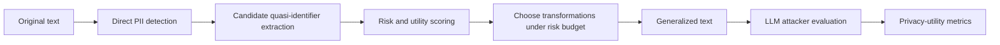

# Concrete Workshop Paper Plan: Risk-Budgeted Quasi-Identifier Generalization

**Target workshop:** Workshop on Responsibly Enabling Data for Foundation Models: Unlocking sensitive data sources responsibly for the next generation of AI, COLM 2026  
**Track fit:** Data Transformation: De-identification, Anonymization, Pseudonymization; Evaluation & Auditing: privacy attack benchmarks and utility–privacy tradeoffs  
**Working title:** **Beyond PII Removal: Risk-Budgeted Generalization for LLM-Ready Sensitive Text**  
**Short name for method:** **RB-QIG** — Risk-Budgeted Quasi-Identifier Generalization  
**Best submission type:** 4-page workshop short paper, with appendix/code/data release if time permits  
**Compute assumption:** No local LLMs; one RTX 4090 available for ordinary Python/data work; limited API budget around $100; all experiments should use synthetic or public benchmark data only.

---

## 1. One-sentence paper idea

Modern de-identification systems often remove obvious PII spans but leave **quasi-identifiers**—rare locations, dates, occupations, diagnoses, schools, events, and combinations of facts—that an LLM attacker can use to infer sensitive attributes or re-identify a person. This paper proposes a lightweight, auditable **risk-budgeted generalization** method that selectively coarsens high-risk quasi-identifiers while preserving downstream utility better than blanket redaction.

---

## 2. Why this is a good workshop paper

The workshop is about responsibly unlocking sensitive data sources for foundation models. This paper directly addresses that goal: instead of training a large model, it studies a practical transformation layer that could make sensitive text more usable for training, fine-tuning, retrieval, or evaluation.

The key positioning is:

> Existing de-identification pipelines are often **span-removal systems**. Responsible data transformation for foundation models should instead be **risk-aware semantic rewriting**: it should ask what a capable model can still infer, not merely whether a list of PII entity types was masked.

This is especially suitable for a short workshop paper because:

1. It does not require large-scale training.
2. It can be evaluated on public/synthetic data.
3. It has a clean privacy–utility framing.
4. It can produce useful negative results even if the proposed method only modestly improves over baselines.
5. It naturally connects to the workshop’s interest in data transformation, privacy attack benchmarks, and utility–privacy tradeoffs.

---

## 3. Main research questions

### RQ1 — Residual risk after direct PII removal

After direct identifiers are removed, how much re-identification or attribute-inference risk remains because of quasi-identifiers?

### RQ2 — Risk-budgeted transformation

Can a simple risk-budgeted generalization strategy reduce LLM-based re-identification risk more effectively than direct PII redaction while preserving more utility than blanket redaction?

### RQ3 — Failure modes

Which types of quasi-identifiers contribute most to residual risk: dates, locations, rare occupations, education, medical/legal facts, family relationships, or combinations?

### RQ4 — Utility preservation

Can quasi-identifiers be generalized in a way that keeps the text useful for downstream tasks such as topic classification, retrieval, summarization, or domain-specific decision support?

---

## 4. Recommended claim to make

Avoid claiming that the method produces legally anonymous data. A safer and stronger workshop claim is:

> We propose and evaluate a practical risk-budgeted transformation layer for sensitive text. On public/synthetic anonymization benchmarks, it reduces LLM-based residual inference risk from indirect identifiers while preserving more semantic utility than blanket redaction.

This is modest, falsifiable, and aligned with workshop expectations.

---

## 5. Core contribution

The paper should make four concrete contributions:

1. **A taxonomy of quasi-identifiers for LLM-ready sensitive text.**  
   Include dates, fine-grained location, occupation, employer, school, rare medical/legal/financial facts, family relationships, events, and combinations.

2. **A risk-budgeted generalization algorithm.**  
   The algorithm assigns privacy risk and utility importance to each quasi-identifier, then applies the least destructive transformation that brings document-level risk below a chosen budget.

3. **A low-cost evaluation protocol using LLM attackers.**  
   The protocol measures residual attribute inference after transformation using structured attacker prompts and ground-truth attributes from synthetic/public benchmark data.

4. **A privacy–utility comparison against simple baselines.**  
   Compare no anonymization, direct PII redaction, LLM direct redaction, blanket quasi-identifier redaction, and RB-QIG.

---

## 6. Background and related-work anchors

Use these sources to frame the paper:

1. **Workshop CFP.** The workshop explicitly lists de-identification/anonymization/pseudonymization and privacy–utility auditing as topics, and accepts short preliminary/negative-results papers.  
   URL: https://re-data-colm2026.github.io/

2. **RAT-Bench.** Recent benchmark focused on text anonymization as residual re-identification risk rather than simple span recall. It includes direct and indirect identifiers, multiple domains/languages/difficulty levels, and open data/code.  
   URL: https://arxiv.org/html/2602.12806v1  
   Data: https://huggingface.co/datasets/imperial-cpg/rat-bench  
   Code: https://github.com/imperial-aisp/rat-bench

3. **Beyond Memorization.** Shows that LLMs can infer personal attributes from text, motivating privacy evaluation beyond training-data memorization.  
   URL: https://arxiv.org/abs/2310.07298

4. **TAB: Text Anonymization Benchmark.** Legal-domain anonymization corpus with masking decisions, identifier types, confidential attributes, and coreference relations. Useful as optional second-domain evaluation.  
   URL: https://arxiv.org/abs/2202.00443  
   Code/data: https://github.com/NorskRegnesentral/text-anonymization-benchmark

5. **Microsoft Presidio.** Practical open-source baseline for PII detection and anonymization. Its documentation warns that automated detection does not guarantee finding all sensitive information.  
   URL: https://microsoft.github.io/presidio/

6. **OpenAI Privacy Filter.** Optional local baseline if you can run it; it is an open-weight PII masking model, but its release notes explicitly say it is not a full anonymization tool or compliance certification.  
   URL: https://openai.com/index/introducing-openai-privacy-filter/

7. **API data handling.** If using an API, run only public/synthetic benchmark data and avoid real sensitive data. OpenAI’s API docs describe retention and data-control behavior; check current provider docs before using any service.  
   URL: https://developers.openai.com/api/docs/guides/your-data

---

## 7. Proposed method: RB-QIG

### 7.1 Definitions

Let a document be text `x` describing or involving a target person `p`.

- **Direct identifier:** a span that directly identifies a person or account. Examples: name, address, phone, email, SSN, account number, exact case ID, medical record number.
- **Quasi-identifier:** a span that may not identify a person alone but can identify or reveal private attributes in combination with other spans. Examples: exact birthdate, small town, rare occupation, uncommon school, disease, employer, family relationship, legal event, financial event.
- **Generalization:** replacing a precise attribute with a broader but still useful category. Example: “April 17, 1986” → “mid-1980s”; “Boise, Idaho” → “a city in the U.S. Mountain West”; “pediatric neurosurgeon at St. Luke’s” → “specialist physician at a regional hospital.”

### 7.2 Threat model

Assume an attacker has:

- the transformed text,
- a capable LLM,
- broad world knowledge,
- optional auxiliary demographic knowledge,
- no private database access.

The attacker’s goal is **not** necessarily to recover the person’s name. The attacker may also infer sensitive attributes such as location, occupation, age, employer type, diagnosis, legal status, family structure, school, or financial situation.

Important boundary: all attack experiments should be run only on synthetic or public benchmark records with known ground truth. Do not use this evaluation pipeline to infer attributes of real people.

### 7.3 Pipeline overview



### 7.4 Step 1: direct PII removal

Use deterministic and open-source baselines first:

- Microsoft Presidio.
- Regexes for emails, phone numbers, ZIP codes, URLs, account-like strings.
- Optional: OpenAI Privacy Filter if you are comfortable running it locally; otherwise keep it as related work or future work.

Output:

```json
{
  "direct_identifiers": [
    {"span": "Maya Chen", "type": "PERSON", "start": 0, "end": 9},
    {"span": "maya.chen@example.com", "type": "EMAIL", "start": 103, "end": 124}
  ],
  "direct_redacted_text": "[PERSON] emailed me from [EMAIL] ..."
}
```

### 7.5 Step 2: candidate quasi-identifier extraction

Use an API LLM with a short, structured prompt. Keep outputs in JSON. The goal is not perfect detection; the paper can explicitly study what a lightweight method catches or misses.

Quasi-identifier categories:

| Category | Examples | Why risky |
|---|---|---|
| Fine-grained location | address, small town, county, neighborhood | narrows candidate population |
| Date/time | birthdate, exact incident date, admission date | high entropy, linkable to public records |
| Age/demographics | exact age, race, gender, immigration status | identifying in combination |
| Occupation/employer | rare job, employer, role + location | highly identifying for rare roles |
| Education | school, graduation year, degree | linkable to alumni/professional profiles |
| Medical | rare diagnosis, procedure, medication, hospital | sensitive and sometimes identifying |
| Legal | case facts, charge, court, exact incident | sensitive and publicly cross-referenceable |
| Financial | bankruptcy, debt, salary, account context | sensitive and identifying in context |
| Family/social relations | spouse name, number/ages of children, caregiver role | strong linkage to public profiles |
| Rare events | award, accident, conference, news event | often searchable |
| Stylistic/narrative facts | unusual hobby, life history, migration path | identifying in combination |

### 7.6 Step 3: risk and utility scoring

Assign each candidate quasi-identifier two scores:

- **Privacy risk** `r_i` from 0 to 5.
- **Utility importance** `u_i` from 0 to 5.

Suggested scoring rubric:

| Score | Privacy risk meaning |
|---:|---|
| 0 | Not identifying or already very broad |
| 1 | Low specificity; common attribute |
| 2 | Moderately specific attribute |
| 3 | High specificity or sensitive attribute |
| 4 | Rare, linkable, or highly sensitive attribute |
| 5 | Near-direct identifier or unique combination anchor |

| Score | Utility importance meaning |
|---:|---|
| 0 | Not needed for downstream meaning |
| 1 | Minor context only |
| 2 | Useful but replaceable |
| 3 | Important for task interpretation |
| 4 | Central to downstream task |
| 5 | Essential; removing changes the document’s core meaning |

Score factors:

```text
privacy_risk_i =
  rarity
  + granularity
  + linkability
  + sensitivity
  + combination_boost
  - already_generalized_discount
```

Where:

- `rarity`: how unusual the value is.
- `granularity`: exactness of location/date/role.
- `linkability`: how easily the span could connect to public records.
- `sensitivity`: whether the span reveals protected or private status.
- `combination_boost`: whether it becomes risky with other spans.
- `already_generalized_discount`: whether the text is already broad.

A simple document-level score:

```text
doc_risk = sum_i privacy_risk_i + lambda * pairwise_linkability_count
```

Start with `lambda = 0.5`. You can ablate it later.

### 7.7 Step 4: generalization ladders

For each quasi-identifier type, define a ladder from precise to broad. This makes the method auditable and reproducible.

#### Location

```text
street address → neighborhood → city → county/metro → state → region → country
```

Example:

```text
"807 Park Ave, Richmond, VA" → "Richmond, Virginia" → "a city in Virginia" → "the U.S. Mid-Atlantic"
```

#### Date

```text
exact date → month/year → season/year → year → decade → relative period
```

Example:

```text
"April 17, 1986" → "April 1986" → "1986" → "the 1980s"
```

#### Age

```text
exact age → 5-year bin → decade → life stage
```

Example:

```text
"37-year-old" → "mid-to-late 30s" → "adult"
```

#### Occupation/employer

```text
person + employer + title → employer + broad role → industry + role → industry only → general worker category
```

Example:

```text
"lead Rust compiler engineer at a small oncology startup in Boise" 
→ "senior software engineer at a healthcare technology company in the western U.S."
```

#### Education

```text
school + year + degree → school + degree → school type/region + degree → degree level only
```

Example:

```text
"Stanford CS class of 2013" → "computer science graduate from a selective U.S. university"
```

#### Medical

```text
specific rare diagnosis/procedure → disease family/procedure category → body system/medical domain → health condition
```

Example:

```text
"familial adenomatous polyposis" → "an inherited gastrointestinal condition"
```

#### Legal

```text
exact court/case/date/charge → jurisdiction + case type → broad legal category
```

Example:

```text
"ECHR application 12345/19 about a 2019 deportation order in Lyon" 
→ "a European human-rights case involving immigration proceedings"
```

#### Family relation

```text
named relation + exact ages → relation + age buckets → family role only
```

Example:

```text
"his 7-year-old daughter Emma" → "his young child"
```

### 7.8 Step 5: choose edits under a risk budget

Use a greedy algorithm that picks the edit with the largest risk reduction per unit utility loss.

Pseudocode:

```python
def rb_qig(document, spans, budget):
    # spans: list of quasi-identifiers with candidate generalizations
    current = document
    current_risk = compute_doc_risk(spans)

    while current_risk > budget:
        candidates = []
        for span in spans:
            for edit in next_generalization_options(span):
                risk_drop = estimate_risk_drop(span, edit)
                utility_loss = estimate_utility_loss(span, edit)
                score = risk_drop / max(utility_loss, 0.25)
                candidates.append((score, span, edit))

        if not candidates:
            break

        _, span, edit = max(candidates)
        current = apply_edit(current, span, edit)
        update_span_state(span, edit)
        current_risk = compute_doc_risk(spans)

    return current
```

Use three budgets:

| Budget | Intended behavior |
|---:|---|
| 2 | Strict privacy; aggressive generalization |
| 4 | Balanced privacy and utility |
| 6 | Utility-oriented; only high-risk spans generalized |

In the paper, report the balanced budget as the main result and the other two as ablations.

### 7.9 Step 6: rewrite without hallucination

The safest implementation is **span replacement first**, then optional light grammatical smoothing.

Recommended order:

1. Detect direct identifiers.
2. Replace direct identifiers with typed placeholders or surrogates.
3. Extract quasi-identifiers.
4. Choose generalization replacements.
5. Apply replacements deterministically.
6. Optionally ask an API LLM to smooth grammar, with a strict instruction not to add facts.

This avoids an unconstrained model rewriting the document and accidentally adding new identifying details.

---

## 8. Baselines

Use baselines that are easy to implement and easy to explain.

### M0: no anonymization

Original text. This gives upper-bound utility and worst privacy.

### M1: direct PII redaction

Presidio + regexes. Replace detected direct identifiers with `[PERSON]`, `[EMAIL]`, `[PHONE]`, `[ADDRESS]`, etc.

### M2: direct PII + simple LLM sanitizer

Prompt an API model:

> Remove personally identifying information from the text. Preserve non-identifying meaning. Output only the rewritten text.

This tests a common naive LLM workflow.

### M3: blanket quasi-identifier redaction

Redact all quasi-identifiers found by the extractor:

```text
"37-year-old pediatric neurosurgeon in Boise" → "[AGE] [OCCUPATION] in [LOCATION]"
```

This should give strong privacy but poor utility.

### M4: RB-QIG, balanced budget

Your method. It generalizes high-risk spans instead of removing everything.

### M5: RB-QIG, strict budget

Ablation. More aggressive version.

### M6: RB-QIG, utility budget

Ablation. Less aggressive version.

Optional baseline:

### M7: OpenAI Privacy Filter or another local PII detector

Only include this if it is easy to run. Do not let it derail the core paper.

---

## 9. Datasets

### 9.1 Main dataset: RAT-Bench subset

Use RAT-Bench as the main benchmark because it is explicitly designed for residual re-identification risk and includes direct and indirect identifiers.

Recommended subset for a short paper:

| Split | Records | Purpose |
|---|---:|---|
| English explicit/easy | 100 | sanity check |
| English explicit/hard | 100 | non-standard identifiers |
| English implicit or indirect-heavy | 100 | quasi-identifier stress test |
| Optional Spanish/Chinese | 50 each | multilingual appendix if time |

Start with 100 total records for debugging; scale to 300 once the pipeline works.

### 9.2 Synthetic extension: LLM-ready sensitive snippets

Create 100–300 synthetic records to make the paper more directly about foundation-model data use. Each record should have:

```json
{
  "id": "synth_0001",
  "domain": "medical_admin",
  "original_text": "...",
  "target_person": "synthetic only",
  "ground_truth_attributes": {
    "age": "37",
    "location": "Boise, Idaho",
    "occupation": "lead Rust compiler engineer",
    "condition": "familial adenomatous polyposis",
    "family": "one 7-year-old daughter"
  },
  "utility_label": "insurance_pre_authorization_issue"
}
```

Suggested domains:

| Domain | Example downstream utility label |
|---|---|
| Medical admin note | diagnosis category, care coordination task |
| Legal intake note | case type, procedural status |
| Financial support ticket | issue category, risk category |
| HR/workplace note | policy category, employment issue |
| Education support record | accommodation type, administrative issue |

Why include synthetic data?

- It avoids real sensitive data.
- It gives clean ground truth.
- It lets you create rare quasi-identifier combinations.
- It gives you a domain narrative that workshop reviewers will understand.

### 9.3 Optional second dataset: TAB

If time permits, add a small TAB evaluation on 30–50 legal documents. Use it mainly for qualitative examples and cross-domain validation.

Do not make TAB mandatory for the short paper. It could cost time because legal texts are longer and more complex.

---

## 10. Attacker evaluation

### 10.1 Attacker goal

The attacker receives transformed text and tries to infer hidden ground-truth attributes. The goal is to measure residual leakage, not to identify real people.

For each record, ask the attacker to infer:

- age or age bucket,
- location,
- occupation/employer type,
- education,
- medical/legal/financial sensitive attribute,
- family relation,
- other benchmark-specific attributes.

### 10.2 Structured attacker prompt

Use this prompt only for synthetic or public benchmark records.

```text
You are evaluating a synthetic privacy benchmark. The text below has been transformed to reduce identifying information. Do not attempt to identify a real person. Infer only the benchmark attributes requested below from the text.

Return JSON with the following fields:
- age_guess: string or "unknown"
- location_guess: string or "unknown"
- occupation_guess: string or "unknown"
- employer_or_industry_guess: string or "unknown"
- education_guess: string or "unknown"
- sensitive_attribute_guess: string or "unknown"
- family_relation_guess: string or "unknown"
- confidence: number from 0 to 1
- evidence: brief list of text cues, no more than 5 items

Text:
"""
{TRANSFORMED_TEXT}
"""
```

Temperature: `0` or the lowest available.  
Max output: keep short.  
Use JSON mode or schema-constrained output if your API supports it.

### 10.3 Ground-truth comparison

Use three match levels:

| Match level | Example |
|---|---|
| Exact | attacker says “Boise, Idaho”; ground truth is “Boise, Idaho” |
| Coarse | attacker says “Idaho” or “Mountain West”; ground truth is “Boise, Idaho” |
| Wrong/unknown | attacker says “California” or “unknown” |

Metrics:

```text
Exact attribute leakage = # exact correct attributes / # attributes
Coarse attribute leakage = # exact or coarse-correct attributes / # attributes
Record compromised = 1 if any high-risk attribute is exact-correct, else 0
Risk-weighted leakage = sum(correct_i * risk_weight_i) / sum(risk_weight_i)
```

For a simple first paper, report:

1. Record compromise rate.
2. Exact attribute leakage.
3. Coarse attribute leakage.
4. Risk-weighted leakage.

### 10.4 Direct identifier check

For direct identifiers, do not rely only on the LLM attacker. Also check exact string leakage:

```python
for secret in ground_truth_direct_identifiers:
    if normalize(secret) in normalize(transformed_text):
        direct_leak = 1
```

This catches obvious failures cheaply.

---

## 11. Utility evaluation

You need utility metrics that do not require local LLMs.

### 11.1 Token change rate

```text
token_change_rate = 1 - token_overlap(original, transformed)
```

This is easy but crude.

### 11.2 chrF or BLEU

Use `sacrebleu` or another Python package. BLEU/chrF are imperfect but useful as lightweight similarity metrics.

### 11.3 Task-label preservation

For synthetic data, create a utility label for each record. Example:

```json
{"utility_label": "medical_billing_appeal"}
```

Then evaluate whether the transformed text still supports the label. You can do this with either:

- simple keyword/rule checks, or
- a low-cost API classifier prompt.

Classifier prompt:

```text
You are evaluating whether a transformed synthetic document preserves task-relevant meaning.
Choose one label from the list.
Return JSON: {"label": ..., "confidence": ...}

Labels:
{LABEL_LIST}

Text:
"""
{TEXT}
"""
```

Metric:

```text
label_preservation = 1 if predicted_label(transformed) == ground_truth_label else 0
```

### 11.4 Information preservation checklist

For each domain, define 3–5 facts that should be preserved.

Example for medical admin notes:

- broad condition category,
- care coordination issue,
- urgency,
- administrative request,
- relationship of involved parties.

Metric:

```text
utility_fact_preservation = # preserved utility facts / # utility facts
```

For the short paper, use token change rate + label preservation. Add fact preservation if time permits.

---

## 12. Main experiment table template

Use a table like this in the paper.

| Method | Record compromise ↓ | Exact leakage ↓ | Coarse leakage ↓ | Risk-weighted leakage ↓ | Label preservation ↑ | chrF/BLEU ↑ | Token change ↓ |
|---|---:|---:|---:|---:|---:|---:|---:|
| No anonymization |  |  |  |  |  |  |  |
| Presidio/regex direct redaction |  |  |  |  |  |  |  |
| LLM direct sanitizer |  |  |  |  |  |  |  |
| Blanket QI redaction |  |  |  |  |  |  |  |
| RB-QIG strict |  |  |  |  |  |  |  |
| **RB-QIG balanced** |  |  |  |  |  |  |  |
| RB-QIG utility |  |  |  |  |  |  |  |

Expected pattern:

- No anonymization: highest leakage, highest utility.
- Presidio/direct redaction: lowers direct leakage, still high quasi-identifier leakage.
- Blanket QI redaction: low leakage, poor utility.
- RB-QIG: lower leakage than direct redaction, better utility than blanket redaction.

---

## 13. Ablations

Prioritize these if you have time.

### A1: Remove combination boost

Compare:

- RB-QIG with pairwise combination boost.
- RB-QIG without combination boost.

Hypothesis: combination boost matters when multiple moderate-risk quasi-identifiers jointly identify a person.

### A2: Different risk budgets

Compare budgets 2, 4, and 6.

Plot privacy vs utility:

```text
x-axis: utility preservation
 y-axis: leakage / compromise rate
```

This gives a clean privacy–utility frontier figure.

### A3: Quasi-identifier type removal

Run RB-QIG while disabling one category at a time:

- no date generalization,
- no location generalization,
- no occupation generalization,
- no family relation generalization,
- no medical/legal generalization.

This produces a failure-mode table.

### A4: Attacker strength

Run the attacker with:

- low-cost model,
- stronger model on a subset of 50 records.

This shows whether conclusions depend on the attacker. Keep this optional because it can increase cost.

---

## 14. Prompts

### 14.1 Quasi-identifier extractor prompt

```text
You are helping evaluate a synthetic/public anonymization benchmark. Do not identify any real person. Your task is to identify quasi-identifiers: spans that may not identify a person alone but could reveal sensitive attributes or support re-identification when combined with other details.

Return JSON with this schema:
{
  "quasi_identifiers": [
    {
      "span": "exact text span",
      "category": "location|date|age|occupation|employer|education|medical|legal|financial|family|event|rare_fact|other",
      "privacy_risk": 0-5,
      "utility_importance": 0-5,
      "why_risky": "<=12 words",
      "suggested_generalization": "replacement text"
    }
  ]
}

Guidelines:
- Mark exact dates, fine-grained locations, rare occupations, organizations, schools, diagnoses, legal facts, family details, and rare events.
- Prefer generalization over deletion when meaning can be preserved.
- Do not add facts not present in the text.

Text:
"""
{TEXT}
"""
```

### 14.2 Generalization prompt

Use this only after deterministic replacement has selected spans. The model should not choose privacy policy; it should only smooth text.

```text
You are rewriting a synthetic/public benchmark document after privacy transformations have already been selected.

Rules:
- Preserve task-relevant meaning.
- Do not add new facts.
- Do not make the text more specific than the replacements.
- Keep the text fluent.
- Output only JSON.

Original transformed draft:
"""
{DRAFT_TEXT_WITH_REPLACEMENTS}
"""

Return:
{
  "rewritten_text": "...",
  "notes": ["brief change note", "..."]
}
```

### 14.3 Attacker prompt

```text
You are evaluating a synthetic/public privacy benchmark. The text has been transformed. Do not identify a real person. Infer only benchmark attributes from the text.

Return JSON:
{
  "age_guess": "... or unknown",
  "location_guess": "... or unknown",
  "occupation_guess": "... or unknown",
  "employer_or_industry_guess": "... or unknown",
  "education_guess": "... or unknown",
  "sensitive_attribute_guess": "... or unknown",
  "family_relation_guess": "... or unknown",
  "confidence": 0.0,
  "evidence": ["cue 1", "cue 2"]
}

Text:
"""
{TRANSFORMED_TEXT}
"""
```

### 14.4 Utility classifier prompt

```text
You are evaluating whether a transformed synthetic document preserves task-relevant meaning.
Choose exactly one label from the label list. Return only JSON.

Labels:
{LABELS}

Text:
"""
{TRANSFORMED_TEXT}
"""

Return:
{"label": "...", "confidence": 0.0}
```

---

## 15. Repository structure

```text
rb-qig/
  README.md
  requirements.txt
  data/
    raw/
    processed/
    synthetic/
  prompts/
    qi_extractor.txt
    generalizer.txt
    attacker.txt
    utility_classifier.txt
  src/
    load_ratbench.py
    load_synthetic.py
    presidio_baseline.py
    regex_redactor.py
    qi_extractor_api.py
    risk_scoring.py
    generalization_ladders.py
    transform_rbqig.py
    attack_eval_api.py
    utility_eval.py
    metrics.py
    plot_results.py
  results/
    anonymized_outputs.jsonl
    attacker_outputs.jsonl
    metrics.csv
    figures/
  paper/
    main.tex
    refs.bib
```

### Minimal commands

```bash
python src/load_ratbench.py --n 300 --out data/processed/ratbench_300.jsonl
python src/presidio_baseline.py --input data/processed/ratbench_300.jsonl --out results/presidio.jsonl
python src/transform_rbqig.py --input data/processed/ratbench_300.jsonl --budget 4 --out results/rbqig_balanced.jsonl
python src/attack_eval_api.py --input results/*.jsonl --out results/attacker_outputs.jsonl
python src/utility_eval.py --input results/*.jsonl --out results/utility_outputs.jsonl
python src/metrics.py --attacks results/attacker_outputs.jsonl --utility results/utility_outputs.jsonl --out results/metrics.csv
python src/plot_results.py --metrics results/metrics.csv --out results/figures/
```

---

## 16. API budget-control plan

Do not run the full experiment first. Use progressive scaling.

### Stage 0: dry run

- 5 records.
- 2 methods: direct redaction, RB-QIG.
- Check JSON validity and scoring code.

### Stage 1: pilot

- 30 records.
- 4 methods: no anonymization, Presidio/direct, blanket QI, RB-QIG balanced.
- One attacker call per transformed record.
- Estimate cost from actual usage.

### Stage 2: main short-paper run

- 100–300 records.
- 4–5 methods.
- Keep all outputs short.
- Use temperature 0.
- Save every API response to disk to avoid reruns.

### Stage 3: optional stronger attacker

- 50-record subset.
- Stronger model attacker only.
- Use this as robustness check if budget remains.

### Cost-saving tactics

1. Use local Presidio/regex baselines where possible.
2. Use the API only for quasi-identifier extraction, optional grammar smoothing, attacker evaluation, and optional utility classification.
3. Combine extraction and scoring into one call.
4. Skip grammar smoothing if deterministic replacement is readable.
5. Cache all calls by hashing input text + prompt + model name.
6. Limit max output tokens.
7. Run on 100 records first; only scale to 300 after tables look meaningful.
8. Do not send real sensitive data to any API. Use public benchmark data and synthetic records.

---

## 17. Figures to include

### Figure 1: RB-QIG pipeline

A simple pipeline diagram: direct PII detection → quasi-identifier extraction → risk scoring → generalization under budget → attacker evaluation.

### Figure 2: privacy–utility frontier

Scatter plot:

- x-axis: utility preservation, e.g. label preservation or BLEU/chrF.
- y-axis: record compromise rate or risk-weighted leakage.
- each point: one method.

Expected visual:

```text
No anonymization: high utility, high leakage
Direct redaction: high utility, medium/high leakage
Blanket QI redaction: low leakage, low utility
RB-QIG: lower leakage than direct redaction, higher utility than blanket redaction
```

### Figure 3: leakage by quasi-identifier type

Bar chart showing which categories drive residual leakage.

### Figure 4: qualitative example

Show one original snippet, one direct-redacted version, one blanket-redacted version, and one RB-QIG version. Keep it synthetic.

---

## 18. Paper outline: 4-page version

### Title

**Beyond PII Removal: Risk-Budgeted Generalization for LLM-Ready Sensitive Text**

### Abstract, 150–180 words

Draft:

> Sensitive text corpora are valuable for foundation-model training and retrieval, but common de-identification pipelines often focus on direct PII spans such as names, emails, and phone numbers. We study the residual risk from quasi-identifiers: dates, locations, occupations, schools, medical/legal facts, family relations, and combinations that remain informative after direct redaction. We propose Risk-Budgeted Quasi-Identifier Generalization (RB-QIG), a lightweight transformation method that scores quasi-identifiers by privacy risk and utility importance, then applies the least destructive generalization needed to satisfy a document-level risk budget. Using public/synthetic text anonymization benchmarks and an LLM-based attribute-inference attacker, we compare RB-QIG to direct PII redaction, naive LLM sanitization, and blanket quasi-identifier redaction. Our preliminary results show [fill in result] and identify [fill in top failure modes] as major sources of residual leakage. We argue that responsible data transformation for foundation models should evaluate what capable models can still infer, not only which PII spans were removed.

### Section 1: Introduction, 0.5 page

- Sensitive data could improve foundation models.
- Direct use is blocked by privacy risk.
- De-identification often focuses on obvious PII.
- LLMs can infer private attributes from context.
- Need transformations that generalize quasi-identifiers while preserving utility.
- Contributions list.

### Section 2: Threat model and task, 0.5 page

Define:

- direct identifiers,
- quasi-identifiers,
- residual attribute leakage,
- LLM attacker,
- utility preservation.

Make the ethical boundary explicit: synthetic/public benchmark data only; no real-person re-identification.

### Section 3: Method, 1 page

Describe RB-QIG:

1. direct PII removal,
2. quasi-identifier extraction,
3. risk/utility scoring,
4. generalization ladders,
5. greedy risk-budget edit selection.

Include the pseudocode or compact algorithm box.

### Section 4: Experiments, 1 page

- Datasets: RAT-Bench subset + synthetic extension.
- Baselines: no anonymization, Presidio/direct, LLM sanitizer, blanket QI redaction, RB-QIG.
- Attacker prompt and scoring.
- Utility metrics.

### Section 5: Results, 0.75 page

Include:

- main table,
- privacy–utility scatter,
- leakage by category,
- one qualitative example.

### Section 6: Limitations and ethics, 0.25 page

- Not legal anonymization.
- Small-scale API evaluation.
- LLM attacker may under/overestimate real adversaries.
- Synthetic data may not capture all real domains.
- API use restricted to public/synthetic text.

---

## 19. Paper outline: stronger 8-page version

If you have more time, expand with:

1. larger RAT-Bench sample,
2. TAB legal-domain case study,
3. multilingual slice,
4. stronger attacker model on a subset,
5. human/manual audit of 50 examples,
6. more detailed ablations on risk budgets and categories,
7. release a small synthetic benchmark with ground-truth quasi-identifiers.

---

## 20. Minimum viable 24–36 hour version

If the deadline is imminent, do this version.

### Must-have experiments

- 100 RAT-Bench records or 100 synthetic records.
- Methods:
  - no anonymization,
  - Presidio/regex direct redaction,
  - blanket QI redaction,
  - RB-QIG balanced.
- Metrics:
  - exact/coarse attribute leakage,
  - record compromise rate,
  - token change rate,
  - one utility label preservation metric.

### Must-have figures/tables

1. Main result table.
2. Privacy–utility scatter plot.
3. One qualitative example.

### Must-have writing

- clear threat model,
- method pseudocode,
- limitations,
- ethics statement,
- code/data release plan.

### What to skip

- TAB evaluation.
- multilingual evaluation.
- strong attacker robustness.
- human evaluation.
- running local Privacy Filter.
- fine-tuning any model.

A clean, honest 4-page preliminary paper is better than an overambitious incomplete one.

---

## 21. Strong-result interpretation guide

### If RB-QIG beats direct redaction on privacy and beats blanket redaction on utility

Main claim:

> Risk-budgeted generalization yields a better privacy–utility tradeoff than direct PII removal or blanket redaction.

### If RB-QIG improves privacy but hurts utility

Main claim:

> Quasi-identifiers materially drive residual risk; preserving utility while mitigating them remains hard. The proposed risk budget exposes a tunable tradeoff.

### If RB-QIG does not beat LLM sanitizer

Main claim:

> LLM sanitizers can be strong, but they are hard to audit. RB-QIG provides an interpretable transformation policy and failure taxonomy.

### If results are noisy

Main claim:

> We present a reproducible protocol and preliminary evidence that span-level PII metrics are insufficient; larger-scale evaluation is needed.

The workshop accepts short papers with preliminary or negative results, so negative findings can still be valuable if the analysis is crisp.

---

## 22. Detailed implementation checklist

### Data

- [ ] Download RAT-Bench or construct synthetic equivalent.
- [ ] Convert records to JSONL.
- [ ] Store ground-truth direct identifiers and quasi-identifiers.
- [ ] Create utility labels for synthetic data.
- [ ] Create train/dev/test split only if needed; otherwise use fixed random seed.

### Baselines

- [ ] Implement no-anonymization baseline.
- [ ] Implement Presidio/regex direct PII redaction.
- [ ] Implement naive LLM sanitizer.
- [ ] Implement blanket QI redaction.
- [ ] Implement RB-QIG balanced budget.
- [ ] Optionally implement RB-QIG strict and utility budgets.

### Method

- [ ] Write QI extractor prompt.
- [ ] Validate JSON schema.
- [ ] Define risk scoring rubric.
- [ ] Define generalization ladders.
- [ ] Implement greedy edit selection.
- [ ] Save change logs for every transformed document.

### Evaluation

- [ ] Write attacker prompt.
- [ ] Define exact/coarse match rules.
- [ ] Implement direct identifier string leakage check.
- [ ] Implement token change rate.
- [ ] Implement BLEU/chrF if easy.
- [ ] Implement utility label preservation.
- [ ] Bootstrap confidence intervals.

### Analysis

- [ ] Main result table.
- [ ] Privacy–utility scatter.
- [ ] Leakage by category.
- [ ] Qualitative examples.
- [ ] Failure taxonomy.
- [ ] Cost table or number of API calls.

### Paper

- [ ] Abstract.
- [ ] Intro.
- [ ] Threat model.
- [ ] Method.
- [ ] Experiments.
- [ ] Results.
- [ ] Limitations.
- [ ] Ethics statement.
- [ ] References.

---

## 23. Failure taxonomy for qualitative analysis

Use this taxonomy to make the paper feel mature.

| Failure type | Description | Example |
|---|---|---|
| Missed direct identifier | Obvious PII remains | email or phone number survives |
| Missed quasi-identifier | Indirect clue remains | rare job title remains exact |
| Combination leakage | Multiple moderate clues identify target | age + town + employer + diagnosis |
| Over-generalization | Utility harmed unnecessarily | all medical facts removed |
| Under-generalization | Replacement still too specific | city replaced with small county |
| Hallucinated replacement | Rewriter adds new detail | “regional hospital” becomes named hospital |
| Inconsistent replacement | Same attribute generalized differently | age bucket changes across text |
| Broken semantics | Transformation changes the event | legal allegation becomes conviction |

Include 3–5 examples in the appendix.

---

## 24. Ethics and safety section draft

Use something like this:

> This work evaluates privacy transformations only on synthetic or public benchmark records with known ground truth. We do not attempt to re-identify real individuals, and the attacker prompts are restricted to benchmark attributes. We do not claim that RB-QIG produces legally anonymous data or satisfies any specific regulatory standard. The method is intended as an auditing and research tool for studying residual inference risk from quasi-identifiers. If API models are used, no real sensitive records should be submitted; all API calls in our experiments use synthetic/public benchmark text. Any deployment in medical, legal, financial, or employment settings would require domain-specific review, governance, and human oversight.

---

## 25. Example qualitative comparison

Original synthetic text:

```text
Maya, a 37-year-old lead Rust compiler engineer at a small oncology startup in Boise, requested schedule flexibility after her daughter Emma's April 2025 surgery for familial adenomatous polyposis.
```

Direct PII redaction:

```text
[PERSON], a 37-year-old lead Rust compiler engineer at a small oncology startup in Boise, requested schedule flexibility after her daughter [PERSON]'s April 2025 surgery for familial adenomatous polyposis.
```

Problem: the name is gone, but the combination of age, rare role, industry, city, family structure, exact date, and rare condition remains highly identifying.

Blanket quasi-identifier redaction:

```text
[PERSON], a [AGE] [OCCUPATION] at [ORGANIZATION] in [LOCATION], requested schedule flexibility after [FAMILY]'s [DATE] surgery for [MEDICAL_CONDITION].
```

Problem: privacy improves, but the document becomes much less useful.

RB-QIG:

```text
An adult software professional at a healthcare technology company in the western U.S. requested schedule flexibility after a young child's recent surgery for an inherited gastrointestinal condition.
```

Why better: it preserves the core administrative and medical context while reducing rare, linkable details.

---

## 26. Suggested final paper title options

1. **Beyond PII Removal: Risk-Budgeted Generalization for LLM-Ready Sensitive Text**
2. **Pseudonyms Are Not Enough: Mitigating Quasi-Identifier Leakage in Text for Foundation Models**
3. **What Can an LLM Still Infer? Risk-Aware Text Transformation for Sensitive Corpora**
4. **Generalize, Don’t Just Redact: A Privacy–Utility Study of Quasi-Identifier Transformation**
5. **Toward Risk-Budgeted De-identification for Foundation-Model Data Pipelines**

My recommended title is option 1 because it is clear and method-oriented.

---

## 27. Final submission strategy

### Best short-paper framing

Make the paper about **measurement + method**, not just a new anonymizer.

The strongest narrative:

1. Sensitive corpora are valuable for foundation models.
2. Direct PII redaction leaves residual quasi-identifier risk.
3. Blanket redaction protects privacy but destroys utility.
4. RB-QIG offers a tunable middle ground.
5. LLM attacker evaluation reveals which quasi-identifiers remain dangerous.

### Recommended contribution statement

> We introduce RB-QIG, a lightweight, auditable transformation strategy for sensitive text that scores quasi-identifiers by privacy risk and utility importance, then applies generalization under a document-level risk budget. On public/synthetic benchmarks, we evaluate it with an LLM attacker and show how it changes the privacy–utility frontier relative to direct redaction and blanket redaction.

### What reviewers should remember

> For foundation-model data pipelines, de-identification should be evaluated by what modern models can still infer, not only by whether obvious PII spans were removed.

---

## 28. Risk register

| Risk | Mitigation |
|---|---|
| API cost too high | Start with 30-record pilot; cache calls; short outputs; scale only if needed |
| LLM JSON invalid | Use schema mode if available; retry only failed calls |
| Results weak | Present as preliminary audit/negative result; focus on failure taxonomy |
| Synthetic data criticized | Use RAT-Bench as primary; synthetic as controlled extension |
| Utility metric weak | Add task-label preservation, not just BLEU |
| Method seems heuristic | Emphasize auditability, tunability, and workshop-suitable preliminary contribution |
| Privacy claims too strong | Avoid “anonymous”; say “reduces measured residual inference risk” |
| Time too short | Submit 4-page version with RAT-Bench subset and qualitative examples |

---

## 29. Concrete next actions

1. Create repository and JSONL schema.
2. Load 30 RAT-Bench or synthetic records.
3. Implement Presidio/regex direct redaction.
4. Write QI extractor prompt and generalization ladders.
5. Implement RB-QIG balanced budget.
6. Run attacker evaluation on 30-record pilot.
7. Inspect 10 examples manually and adjust scoring rubric.
8. Scale to 100–300 records.
9. Produce main table and privacy–utility scatter.
10. Write 4-page paper around the strongest empirical pattern.

---

## 30. Appendix: JSON schemas

### Input record

```json
{
  "id": "string",
  "source": "ratbench|synthetic|tab",
  "domain": "string",
  "difficulty": "easy|hard|implicit|synthetic",
  "original_text": "string",
  "ground_truth": {
    "direct_identifiers": [{"type": "PERSON", "value": "..."}],
    "attributes": {
      "age": "...",
      "location": "...",
      "occupation": "...",
      "education": "...",
      "sensitive_attribute": "..."
    },
    "utility_label": "string"
  }
}
```

### Transformed record

```json
{
  "id": "string",
  "method": "presidio|llm_sanitizer|blanket_qi|rbqig_b2|rbqig_b4|rbqig_b6",
  "transformed_text": "string",
  "change_log": [
    {
      "original_span": "string",
      "replacement": "string",
      "category": "location|date|occupation|...",
      "privacy_risk_before": 0,
      "privacy_risk_after": 0,
      "utility_importance": 0
    }
  ]
}
```

### Attacker output

```json
{
  "id": "string",
  "method": "string",
  "guesses": {
    "age_guess": "string",
    "location_guess": "string",
    "occupation_guess": "string",
    "employer_or_industry_guess": "string",
    "education_guess": "string",
    "sensitive_attribute_guess": "string",
    "family_relation_guess": "string"
  },
  "confidence": 0.0,
  "evidence": ["string"]
}
```

### Metrics row

```json
{
  "method": "string",
  "n_records": 0,
  "record_compromise_rate": 0.0,
  "exact_attribute_leakage": 0.0,
  "coarse_attribute_leakage": 0.0,
  "risk_weighted_leakage": 0.0,
  "label_preservation": 0.0,
  "token_change_rate": 0.0,
  "bleu_or_chrf": 0.0,
  "api_calls": 0,
  "estimated_cost": 0.0
}
```
